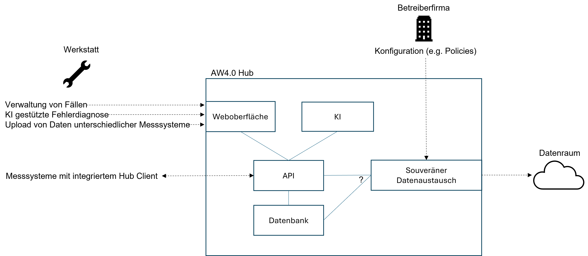

# Hintergrund

Im Projekt gibt es drei Hauptthemen:

- Innovative Messtechnik
- KI gestützte Fehlerdiagnose
- Gaia-X

Im Rahmen der 2022 durchgeführten Arbeiten und Gespräche wurden verschiedene 
Anforderungen in diesen Bereichen identifiziert, also Aufgaben / Probleme, 
die durch das **System Autowerkstatt 4.0** gelöst werden sollen.

Um die Anforderungen Ableiten zu können wurden in Abschnitt [Szenarien](#Szenarien) vier Szenarien formuliert. Die daraus resultierenden Aufgaben/Probleme werden im Abschnitt [Anforderungsanalyse](#anforderungsanalyse) genauer beschrieben. Darauf aufbauend wird im Abschnitt [Lösungsansatz](#losungsansatz) eine Übersicht des AW4.0 Hub präsentiert.

## Szenarien
Ein Szenario ist eine Situation, die mögliche Ereignisse, Bedingungen und Folgen beschreibt.

### Szenario 1: Kauf von Assets
Die Werkstatt hat bisher nur ältere Modelle zur Diagnose von Fahrzeugen, die nicht mehr alle Funktionen abdecken können. Sie möchte daher ein neues Modell erwerben, das auf dem neuesten Stand der Technik ist und alle relevanten Daten auswerten kann. Um ein solches Modell zu finden, nutzt sie die Datenraum-Oberfläche des Werkstatt-Hubs, der einen Markt für den Austausch von Daten und Dienstleistungen zwischen Werkstätten und anderen Akteuren bietet. Dort kann sie nach verschiedenen Kriterien nach passenden Modellen suchen, wie z.B. Preis, Leistung, Bewertung oder Verfügbarkeit.

Nach einer kurzen Suche findet sie ein Modell, das ihren Anforderungen entspricht. Sie entscheidet sich, das Modell zu kaufen und schließt einen Vertrag mit dem Anbieter ab. Der Vertrag regelt die Bedingungen für die Nutzung des Modells, wie z.B. die Laufzeit, den Umfang, die Kosten oder die Haftung. Nachdem der Vertrag abgeschlossen ist, wird das Modell entweder auf den Werkstatt-Hub geladen oder der Zugriff auf das Modell wird über den Datenraum gewährt. Die Werkstatt kann nun das Modell zur Diagnose von Fahrzeugen verwenden.

## Szenario 2: Verkauf von Assets
Um ihre Wettbewerbsfähigkeit zu erhöhen, plant die Werkstatt, ihre gesammelten Fahrzeugdaten als Asset zu vermarkten. Die Werkstatt hat bereits mehrere Fahrzeuge über den Werkstatt-Hub diagnostiziert und dabei Daten erzeugt. Die Werkstatt möchte diese Daten nutzen, um in Zukunft bessere Diagnosemodelle anwenden zu können. Mit Hilfe der Datentraum Oberfläche kann die Werkstatt, die von ihr gewünschten Daten auswählen und zu einem Asset bündeln. Die Werkstatt legt die Vertragsbedingungen fest und erstellt eine Asset-Beschreibung. Die Werkstatt-Daten werden anonymisiert und als Asset-Angebot auf den Markt gebracht.

## Szenario 3: Diagnose
Die Werkstatt führt eine Diagnose am Fahrzeug mittels des AW 4.0 Werkstatt-Hubs durch. In diesem Szenario beschreiben wir die Diagnose anhand von Oszilloskop Daten.

Eine Werkstatt erhält ein Fahrzeug zur Diagnose, das einen Fehler aufweist. Um die Ursache des Fehlers zu ermitteln, nutzt die Werkstatt den AW 4.0 Werkstatt-Hub und legt einen Fall für die Diagnose an. Der Werkstatt-Hub liest die OBD-Daten des Fahrzeugs aus und vergleicht sie mit dem Wissensgraphen, um das wahrscheinlichste defekte Bauteil zu bestimmen. Anschließend ruft der Werkstatt-Hub die entsprechende Diagnose für das Bauteil auf und gibt der Werkstatt die Anforderungen und Anweisungen für eine OszilloskopMessung. Die Werkstatt führt die Messung gemäß den Vorgaben durch und leitet die Messdaten an den Werkstatt-Hub weiter. Der Werkstatt-Hub interpretiert die Messdaten und identifiziert das defekte Bauteil. Nachdem die Werkstatt das Bauteil ausgetauscht hat, markiert sie den Fall im Werkstatt-Hub als abgeschlossen.

## Szenario 4: Onboarding
Um die Sicherheit und Integrität der Daten im Datenraum zu gewährleisten, müssen neue Teilnehmer einen standardisierten Onboarding-Prozess durchlaufen. Dieser Prozess besteht aus folgenden Schritten:

1. Der neue Teilnehmer bekundet sein Interesse an dem Datenraum und erklärt seine Bereitschaft, die Regeln und Anforderungen des Datenraums einzuhalten.
2. Der neue Teilnehmer füllt ein Formular aus, in dem er seine Identität, seine Ziele und seine Datenbedarfe angibt. Dieses Formular wird an den Föderator des Datenraums gesendet, der die Rolle eines Vermittlers und Vertrauenswürdigen Dritten hat.
3. Der Föderator prüft die Angaben des neuen Teilnehmers und vergleicht sie mit den Kriterien und Erwartungen des Datenraums. Der Föderator kann auch zusätzliche Informationen oder Nachweise vom neuen Teilnehmer anfordern, um seine Eignung zu bestätigen.
4. Wenn der Föderator den neuen Teilnehmer für geeignet hält, stellt er ihm ein digitales Zertifikat aus, das seine Identität und seine Berechtigung zur Teilnahme am Datenraum bestätigt. Das Zertifikat enthält auch die Zugangsdaten und die technischen Spezifikationen für den Datenraum.
5. Der neue Teilnehmer wird in den Datenraum aufgenommen und kann auf die verfügbaren Daten zugreifen oder eigene Daten bereitstellen. Die anderen Mitglieder des Datenraums werden über den neuen Teilnehmer informiert und können mit ihm kommunizieren oder kooperieren.

## Anforderungsanalyse

Im AW4.0 Universum gibt es verschiedene *Rollen*, also Benutzer- / Anwenderebenen
die mit dem System interagieren. Diese sind:

- Werkstatt
- Betreiberfirma
- Datenraum
- Fahrzeug
- Messsystem

Diese Rollen sind mit ihren jeweiligen Beziehungen im untenstehenden Diagramm dargestellt.

Aufbauend auf diesen Überlegungen zur Struktur des AW4.0 Universums lassen sich 
vielfältige Anforderungen identifizieren, also konkrete Funktionalitäten, die das 
System haben soll. Diese werden im Folgenden beschrieben.

Neben der Durchführung von Messungen muss im Umfeld der Werkstatt ein einfaches 
*Datenmanagement* vorausgesetzt werden.
Es sollte dabei möglich sein, neue "Fälle" anzulegen, wenn ein Auto in die Werkstatt kommt.
Diese Fälle sollten z.B. bearbeitet, durchsucht und gelöscht werden können.

Mitarbeiter in Werkstätten sollten außerdem die Möglichkeit haben, KI unterstützte
Fehlerdiagnose durchzuführen, also die am DFKI entwickelte State Machine anzuwenden.
Dabei soll die Integration gängiger Messsysteme von verschiedenen Herstellern 
berücksichtigt werden, d.h. es sollte möglich sein, die Daten unterschiedlicher Messsysteme
zu einem Fall hinzuzufügen, damit diese von der KI verwertet werden können.

Autowerkstatt 4.0 soll außerdem Anforderungen auf der höher gelagerten Ebene der 
Betreiberfirma erfüllen. Hier sollte es möglich sein, die eigenen Geschäftsdaten sicher zu 
verwalten, wobei insbesondere der Schutz personenbezogener Informationen von Mitarbeitern
und Kunden sicherzustellen ist.

Eine weitere Anforderung im Umfeld der Betreiberfirma ist die *Teilnahme am AW4.0 
Datenraum*.

### Teilnahme am AW 4.0 Datenraum
Der Werkstatt-Hub muss einen nach der Gaia-X 10.23 Architektur konformen Zugriff auf den Datenraum gewährleisten. Dabei fungiert der Hub jeweils in der Rolle des Consumers (Kauf von Assets, wie KI-Modellen)) und Providers (Verkauf von Assets wie Daten). Daraus ergeben sich folgende Anforderungen:

- Erwerb/Integration eines Gaia-X Credentials, mit welchem man sich als self sovereign identity ausweisen kann. 
- Identifikation im Datenraum mit einem (erweiterten) Gaia-X Credential
- Vertragsabwicklung für den Kauf von Assets, sowie das Aufsetzen eigener Verträge (Policies) für den Verkauf von Assets.
- Selbstbestimmter Erwerb von Assets aus dem Datenraum für eine effizientere Diagnose.
- Selbstbestimmter Verkauf von Assets im Datenraum, hierbei muss sichergestellt werden, dass keine personenbeziehbaren Daten veräußert werden können.
- Empfang von Assets als Consumer, Weitergabe von Assets als Provider

## Lösungsansatz

Das auf dieser Website beschriebene System ist ein Prototyp für den *Autowerkstatt 4.0
Hub*. Dieser ist ein IT-System, mit dem die im vorherigen Abschnitt beschriebenen 
Anforderungen erfüllt werden sollen. 

Die wichtigsten Ideen sind:

*Eine Betreiberfirma hat einen AW4.0 Hub.*

- Dieser ist ein Firmen-eigenes IT-System, auf dem nur die eigenen Geschäftsdaten verwaltet
werden.
- Nur die eigenen Mitarbeiter (in Werkstätten oder Zentrale) interagieren mit diesem
System.

*Ein Hub besteht aus verschiedenen Services / Komponenten.*

- Diese stellen für die Mitarbeiter in den Werkstätten die benötigten Funktionalitäten 
zur Verwaltung von Fällen und zur KI gestützten Fehlerdiagnose bereit.
- Weitere Services ermöglichen der Betreiberfirma die selbstbestimmte Verwaltung und 
Weitergabe der eigenen Geschäftsdaten.

Damit ist der Hub wie in der folgenden Abbildung dargestellt in das AW4.0 Universum 
einzuordnen:

Im Gegensatz zu früheren Ideen gibt es im AW4.0 Universum also hier nicht *eine 
Datenpipeline* und *einen Server*. Dieses Grundgerüst erscheint nicht sinnvoll, da die
selbstbestimmte Verwaltung und Weitergabe der eigenen Geschäftsdaten eine essenzielle
Anforderung an das System ist.

Weitere Kernaspekte des AW4.0 Hubs sind:

*Separation of Concerns*

- Messsysteme mit denen Daten am Fahrzeug generiert werden, sind nicht Teil des Hubs. Die 
Interfaces des Hubs sind jedoch so gestaltet, dass die Integration verschiedener 
Messsysteme gewährleistet ist.
- KI (e.g. die State Machine) wird auf dem Hub ausgeführt und nicht auf einem Messgerät,
da dies die Integration verschiedener propriäterer Messsysteme deutlich erschweren würde.

*Flexible Interaktionsmöglichkeiten*

- Über eine Weboberfläche können die Fälle der eigenen Werkstatt eingesehen und verwaltet 
werden sowie Daten unterschiedlicher Messsysteme
hochgeladen werden.
- Alternativ können spezialisierter Messsysteme direkt über eine API mit dem Hub 
kommunizieren.

*Flexible physische Ausgestaltung*

- On-premise vs. Cloud
- Single-host vs. Verteiltes System

Die folgende Abbildung zeigt eine Architektur Skizze des Hub Prototypen:

**Anmerkungen**

Es gibt noch weitere Anforderungen und daraus abgeleitete Services, die hier nicht 
dargestellt wurden, aber berücksichtigt werden müssen. Dazu zählt beispielsweise die 
Anforderung *Authentifizierung und Autorisierung*.

Die Architekturskizze soll nur eine Grundidee basierend auf den vorgestellten Rollen und 
Anforderungen illustrieren.

Alle Komponenten in der Skizze erfordern weitere spezifische Anforderungsanalysen und 
daraus abgeleitete Designs. Insbesondere die Komponenten *KI* und
*souveräner Datenaustausch* setzen sich wiederum aus mehreren Services zusammensetzen.
