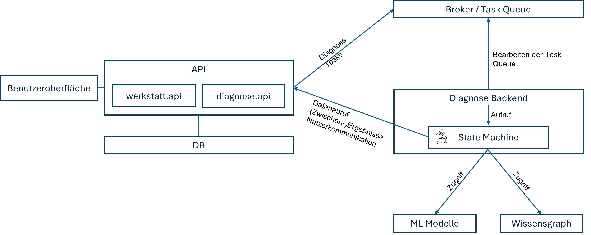

# KI

In diesem Abschnitt wird beschrieben, wie die Funktionalität zur KI 
unterstützten Fehlerdiagnose umgesetzt ist.

## Vorüberlegungen

Kernstück der KI unterstützten Fehlerdiagnose ist die am DFKI entwickelte 
**State Machine**.  
Die State Machine nutzt
- Am Fahrzeug generierte Messdaten, also insbesondere OBD Daten und Oszillogramme
- Einen Wissensgraph zur Beurteilung der OBD Daten
- ML Modelle zur Bewertung von Oszillogrammen

Die State Machine ist ein Agent, der viele komplexe Schritte der Fehlerdiagnose 
weitgehend autonom durchführt. Insbesondere die Anwendung von Wissensgraph und 
ML Modellen wird eigenständig gehandhabt.
Der Nutzer hat lediglich die benötigten Eingabedaten zur Verfügung zu stellen.
Diese werden zum Teil erst während der Fehlerdiagnose ermittelt. Beispielsweise
entscheidet die State Machine erst nach Auswertung der Fehlercodes, für welche 
Bauteile Oszillogramme zu erstellen sind. Entsprechende Anweisungen müssen dann 
an den Nutzer übermittelt werden.
Die Diagnose kann fortgesetzt werden, sobald der Nutzer die Daten zur Verfügung 
gestellt hat.

Aus Nutzersicht werden die folgenden Anforderungen an das KI gestützte
Diagnosesystem festgelegt:

- Diagnose Management: Starten, Abbrechen etc.
- Informationen über Zustand und Ergebnisse der Diagnose einsehen
- Benachrichtigt werden, wenn eine eigene Handlung erforderlich ist (z.B. Daten 
hochladen)
- Es müssen mehrere „offene“ Diagnosen gleichzeitig vorliegen können, e.g. wenn 
eine Diagnose auf ein bestimmtes Oszillogramm „wartet“, dann sollte es möglich 
sein, weiter an anderen Fällen zu arbeiten
- Die Diagnose sollte automatisch weitergehen, sobald benötigte Nutzerhandlungen 
(z.B. Daten hochladen) ausgeführt wurden

Auch die State Machine als "Rechenkern" des Diagnosesystems stellt eine Reihe
von Anforderungen an das System, in das sie eingebettet sind. Diese sind:

- Zugriff auf Messdaten / Informationen zum Fall (Fehlercodes und Oszillogramme)
- Nutzerkommunikation ((Zwischen-)Ergebnisse, benötigte Daten etc.)
- Laden von ML Modellen für die Oszillogramme spezifischer Bauteile
- Zugriff auf (zentralen) Wissensgraph

Es ist auch vorgesehen, dass das Diagnosesystem nicht direkt auf die Datenbank 
des Hubs zugreift, sondern über eine dedizierte API. Dadurch wird sichergestellt, 
dass nur die benötigten Messdaten in das Diagnosesystem gelangen und keine anderen 
Geschäfts- oder Kundendaten.

## State Machine Integration

Die unten stehende Abbildung skizziert die Integration der State Machine.

Beschreibung der Abbildung:  
AnwenderInnen interagieren über eine Benutzeroberfläche mit dem System. Über 
diese können die durch die `werkstatt.api` definierten Datenmanagement 
Operationen durchgeführt werden. Dies sind u.A. *Anlegen* und *Bearbeiten 
von Fällen*, *Hochladen von Fahrzeugdaten* (Fehlercodes, Oszillogramme), das
*Starten der Diagnose* für einen Fall und der *Abruf von Informationen zum
aktuellen Diagnosezustand*.

Die Aktionen *Starten der Diagnose* und *Hochladen von Fahrzeugdaten* (für Fall
mit gestarteter Diagnose) triggern die Erzeugung eines Diagnose Tasks, der vom
API Service in einer Task Queue abgelegt wird. 

Diese wird kontinuierlich vom Diagnose Backend Service bearbeitet.
In diesen ist die State Machine als Softwarebibliothek eingebunden. Die
State Machine interagiert mit dem Datenkern des Hubs über die `diagnose.api`.
Diese ermöglicht den Abruf der relevanten Daten zum Fall, sowie das Senden
von Zwischenergebnissen und Messaufträgen. Auf diese Informationen können
Anwender wiederum mittels der `werkstatt.api` zugreifen.

Durch diesen *asynchronen Dialog* zwischen Anwendern und State Machine 
wird sichergestellt, dass sich auf einem AW4.0 Hub mehrere Diagnosen gleichzeitig
"in Bearbeitung" befinden können, ohne dass dies die Interaktionsmöglichkeiten
von Anwendern mit dem Datenkern blockiert oder einschränkt.

Zur Umsetzung der Task Queue basierten Kommunikation zwischen API und Diagnose
Backend verwendet der Hub Prototyp [Celery](https://docs.celeryq.dev/en/stable/)
mit [Redis](https://redis.io/) als Broker verwendet.

## Skalierbarkeit

Der Prototyp beinhaltet derzeit jeden Service einmal. Im Szenario einer sehr
großen Betreiberfirma mit vielen Werkstätten ist es denkbar, dass viele offene
Diagnosen gleichzeitig vorliegen. Aufgrund der potenziell rechenintensiven Ausführung
der State Machine ist nicht auszuschließen, dass es dabei zu 
längeren Wartezeiten kommt, falls die Task Queue nur von einem Diagnose Backend 
bearbeitet wird. 
Der im vorherigen Abschnitt vorgestellte Integrationsansatz kann horizontal
Skaliert werden, indem Replikate des Diagnose Backends die Task Queue parallel
bearbeiten.