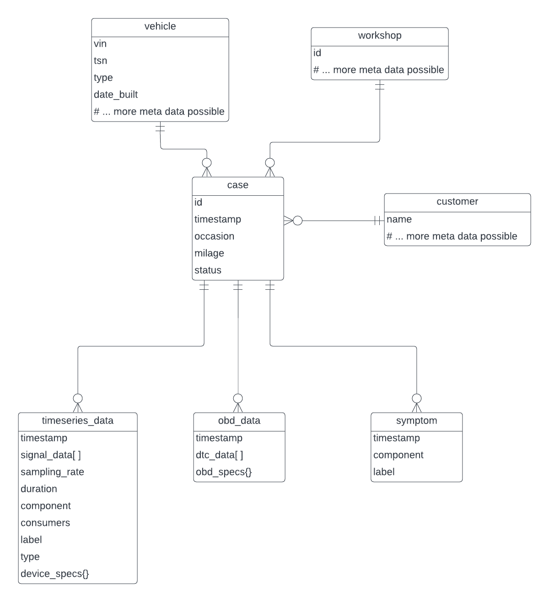

# Datenbank

Die Datenbank speichert die zur KI geführten Fehlerdiagnose relevanten Daten
einer Betreiberfirma in einem standardisierten Schema.

## Konzeptionelles Datenschema

Ein Fall (`case`) repräsentiert genau einen Aufenthalt genau eines Fahrzeugs
(`vehicle`) in genauer einer Werkstatt (`workshop`).
Der Fall ist dabei mit genau einem Kunden (`customer`) assoziiert, also
beispielsweise der Person oder Firma, die das Fahrzeug in die Werkstatt bringt.

Während des Werkstattaufenthalts des Fahrzeugs werden diagnostische Daten zu
dem Fall hinzugefügt. Es werden drei verschiedene Typen von diagnostischen
Daten in Betracht gezogen:  

- Zeitreihen Daten (`timeseries_data`)
- OBD Daten (`obd_data`)
- Symptome (`symptom`)

Die untenstehenden Abbildung zeigt ein auf diesen Überlegungen basierendes
ER Diagramm:

Der nächste Abschnitt enthält eine detailiertere Beschreibung der verschiedenen
Entitäten.

### Details zu den Entitäten

#### `case`

Ein Fall repräsentiert genau einen Aufenthalt genau eines Fahrzeugs in genauer
einer Werkstatt und ist das zentrale organisierende Objekt im Datenmodell.
Ein Fall beinhaltet die folgenden atomaren Attribute:

| Attribut    | Beschreibung                       | Beispiele                               |
|-------------|------------------------------------|-----------------------------------------|
| `id`        | Eindeutiger Identifikator          |                                         |
| `timestamp` | Zeitpunkt der Erstellung           |                                         |
| `occasion`  | Anlass für den Werkstattaufenthalt | "Service / Routine", "Problem / Defekt" |
| `milage`    | Aktueller Kilometerstand           |                                         |
| `status`    | Status des Falls                   | "open", "closed"                        |

#### `vehicle`

Repräsentiert das Fahrzeug als technisches Objekt. Jede Instanz, identifiziert
durch seine `vin`, existiert höchstens einmal in der Datenbank. Aktuell werden
außerdem die Attribute `tsn` und Baujahr (`year_built`) verwendet. Theoretisch
sind auch weitere technische Attribute denkbar, solange diese sich nicht mit
der Zeit ändern, also beispielsweise *Hersteller*, *Fahrzeugtyp* etc.  
Attribute die den Zustand des Fahrzeugs *zu einem bestimmten Zeitpunkt*
beschreiben  werden nicht der Fahrzeug Entität, sondern dem Fall zugeordnet
(Beispiel: Kilometerstand).

#### `workshop`

Repräsentiert eine spezifische Werkstatt. Diese Informationen wird eigentlich 
nicht für diagnostische oder KI Anwendungen benötigt. Da ein Hub aber zu einer
*Betreiberfirma* gehört die wiederum mehrere Werkstätten betreiben könnte,
ist es innerhalb eines Hubs nötig nachzuhalten, welche Fälle zu welcher
Werkstatt gehören.
Theoretisch könnten dieser Entität noch weitere Meta Daten zur Werkstatt
zugeordnet werden wie z.B. Kontakt Informationen. Der Hub Prototyp beinhaltet
diese Informationen noch nicht.

#### `customer`

Repräsentiert diejenige Person / Firma, die das Fahrzeug in die Werkstatt bringt,
üblicherweise also den/die Besitzer/in des Fahrzeugs zum Zeitpunkt des Falls.
Auch diese Information wird eigentlich nicht zu Diagnosezwecken oder für KI
Anwendungen benötigt.
Die Kundenentität ist im aktuellen Prototypen dennoch enthalten, da so z.B. das
Durchsuchen von Fällen nach Kunde möglich ist. Es liegt nahe, dass dies in einem
realistischen Anwendungsszenario eine nützliche Funktionalität ist.

Mit Blick auf die Gaia-X Storyline im Projekt kann die Berücksichtigung von
(möglicherweise künstlichen) Kundendaten auzßerdem nützlich sein um verschiedene
Konzepte zu illustrieren:

- Für die Betreiberfirma ist das Handling von Kundendaten ein normaler
Bestandteil des eigenen Geschäftsprozesses. Diese Informationen sind zu entfernen,
bevor Daten mit Partnern im AW4.0 Datenraum geteilt werden
- Transparenz: Der Datensatz ermöglich die Beantwortung von Kundenanfragen wie "Welche Daten liegen über mich vor?"

#### `timeseries_data`

Eine Instanz repräsentiert eine einzelne Zeitreihen Messung, also z.B. ein
Oszilloskop Signal. Attribute sind in der folgenden Tabelle genauer beschrieben.

| Attribut    | Beschreibung                                                                                                                                                                               | Beispiele                                             |                                                                                                                                                                                           
|-------------|--------------------------------------------------------------------------------------------------------------------------------------------------------------------------------------------|-------------------------------------------------------|
| `timestamp` | Zeitpunkt der Erstellung                                                                                                                                                                   |                                                       |
| `signal[]`  | Das eigentliche Signal, e.g Array mit Floats                                                                                                                                               |                                                       |
| `sampling_rate` | Abtastrate der Messung in Hz                                                                                                                                                               |                                                       |
| `duration`  | Dauer der Messung in Sekunden                                                                                                                                                              |                                                       |
| `component` | Das gemessene Fahrzeugbauteil                                                                                                                                                              | "Batterie"                                            |
| `label`     | Label des Datensatzes                                                                                                                                                                      | "Regelfall / Unauffällig", "Anomalie / Auffälligkeit" |
| `type`      | Typ des Datensatzes                                                                                                                                                                        | "oscillogram", "engine load"                         |
| `device_specs{}` | Technische Spezifikationen des Messgeräts. "`{}`" bedeutet hier, das dies ein nicht-standardisiertes Objekt mit verschiedenen key-value Paaren sein kann, abhängig vom benutzten Messgerät |                                                       |

#### `obd_data`

Eine Instanz repräsentiert das einmalige Auslesen des Fahrzeug Fehlerspeichers.
Attribute sind in der folgenden Tabelle genauer beschrieben.

| Attribut      | Beschreibung                                                                                                                                                                                                                                                       |  Beispiele |
|---------------|--------------------------------------------------------------------------------------------------------------------------------------------------------------------------------------------------------------------------------------------------------------------| ---------|
| `timestamp`   | Zeitpunkt der Erstellung                                                                                                                                                                                                                                           ||
| `dtcs[]`      | Array mit DTCs                                                                                                                                                                                                                                                     | ["P0101", "P0202", "P0303"] |
| `obd_specs{}` | Technische Spezifikationen des Messgeräts. "`{}`" bedeutet hier, das dies ein nicht-standardisiertes Objekt mit verschiedenen key-value Paaren sein kann, abhängig vom benutzten Messgerät |  |

#### `symptom`

Eine Instanz repräsentiert das Ergebnis einer (manuellen / ausführlichen / 
nicht durch die anderen Datentypen abgedeckten) Überprüfung eines spezifischen
Bauteils. Attribute sind in der folgenden Tabelle genauer beschrieben.

| Attribute   | Description                     | Examples                 |
|-------------|---------------------------------|--------------------------|
| `timestamp` | Zeitpunkt der Erstellung        |                          |
| `component` | Das untersuchte Fahrzeugbauteil | "Lichtmaschine"          |
| `label`     | Das Ergebnis der Untersuchung   | "defekt", "nicht defekt" |

### Anmerkungen zum Datenmodell

#### Anmerkung 1: `customer` - `vehicle` Relation

Die *real-world* Relation "besitzt" zwischen Kunde und Fahrzeug wird im hier
vorgestellten Datenmodell nicht durch eine direkte Verbindung zwischen `customer`
und `vehicle` berücksichtigt. Die Begründung ist wie folgt:  
Die Relation ist eine *many-to-many* Beziehung. Ein/Eine Kunde/Kundin besitzt im
Laufe der Zeit mehrere Fahrzeuge und ein Fahrzeug hat über seine Nutzungsdauer
mehrere Besitzer. Sowohl für Kunden, als auch für Fahrzeuge sollte jede
*real-world* Instanz höchstens einmal in der Hub Datenbank sein, um
Inkonsistenzen zu vermeiden, z.B. wenn Meta Daten aktualisiert werden.
Desweiteren ist ein spezifisches (`customer`, `vehicle`) Paar nur über eine
bestimmte Zeit Teil der "besitzt" Relation. Die *many-to-many* Relation müsste
also ohnehin durch eine dedizierte Tabelle repräsentiert werden und nicht
mittels Fremdschlüsseln die direkt von `vehicle` zu `customer` (oder andersherum)
verweisen.
Die Aufgabe dieser dedizierten Tabelle wird bereits durch die Liste der Fälle
abgedeckt.

## Technische Umsetzung

Die Umsetzung des oben beschriebenen Datenmodells ist mit verschiedenen
relationalen und nicht-relationalen Datenbanksystemen denkbar.
Für den Hub Prototypen ist die Entscheidung zunächst auf
[MongoDB](https://www.mongodb.com/) gefallen, da ...
- ... das flexible Dokumenten-basierte Datenmodell eine einfachere Anpassung
im Laufe des Projekts ermöglicht
- ... mit [GridFS](https://www.mongodb.com/docs/manual/core/gridfs/) die
Möglichkeit besteht auch größere Oszilloskop Signale im Binärformat zu speichern