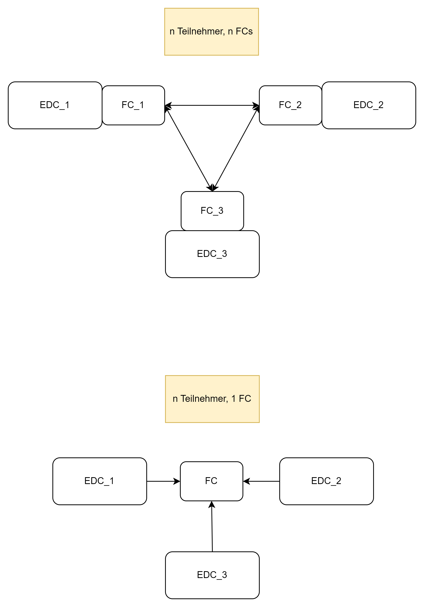

# Federated Catalog

Der Federated Catalog (FC) entspricht einer Liste sämtlicher Teilnehmer eines Datenraumes mitsamt ihrer angebotenen Services und Assets. Die FC-Implementierung des AW4.0-EDC
sieht vor, dass jeder Teilnehmer im Datenraum einen eigenen FC enthält, dieser also dezentral organisiert ist. In einem Datenraum mit n Teilnehmern gibt es also
n FCs. Das Gegenstück zu diesem Konzept wäre ein zentral-organisierter FC, n Teilnehmer greifen also auf 1 FC zu.



Der FederatedCatalogApiController der FC-Extension liefert drei weitere Endpunkte zu den bereits vorhandenen. Die Beispiele sind aus Sicht eines hypothetischen Datenraumteilnehmers "LMIS" beschrieben:

## /federatedcatalog

Dieser Endpunkt gibt die zuvor beschriebene Liste sämtlicher Datenraumteilnehmer mitsamt ihrer angebotenen Services und Assets zurück. Der EDC erwartet hierbei eine explizite Query im JSON-Body.

Beispiel:

````
POST http://<LMIS-Adresse>/management/federatedcatalog/
````
mit Body
````
{
    "@context": {
    "edc": "https://w3id.org/edc/v0.0.1/ns/"
    },
    "querySpec": {
    "offset": 0,
    "limit": 50,
    "sortOrder": "DESC",
    "sortField": "fieldName",
    "filterExpression": []
    }
}
````
Unmittelbar nach dem Start des EDC ist der Federated Catalog leer, der Post-Request liefert also eine leere Liste zurück.
## /insert

Mithilfe dieses Endpunkts könnten erste beziehungsweise weitere Datenraumteilnehmer in dem jeweils eigenen Federated Catalog registriert werden.

Beispiel:

Ein neuer Datenraumteilnehmer "HSOS" ist im Besitz des EDC_2, der Datenraumteilnehmer "LMIS" mit EDC_1 möchte diesen crawlen.


````
POST http://<LMIS-Adresse>/management/federatedcatalog/insert
````
mit Body

````
{
    "name": "HSOS",
    "url": "http://<HSOS-Adresse>:8282/protocol",
    "supportedProtocols": [
        "dataspace-protocol-http"
    ]
}
````

"LMIS" kann nun seinen eigenen /federatedcatalog-Endpunkt mit der im vorherigen Beispiel gezeigten Query ansprechen und erhält den folgenden Eintrag:

````
[
    {
        "@id": "e3f5436b-ee50-4ea9-ad7d-2cc46f164105",
        "@type": "dcat:Catalog",
        "dcat:dataset": [],
        "dcat:service": {
            "@id": "135543b0-2aa1-49e8-9079-bd307020fea0",
            "@type": "dcat:DataService",
            "dct:terms": "connector",
            "dct:endpointUrl": "http://<HSOS-Adresse>:8282/protocol"
        },
        "edc:originator": "http://<HSOS-Adresse>:8282/protocol",
        "edc:participantId": "provider",
        "@context": {
            "dct": "https://purl.org/dc/terms/",
            "edc": "https://w3id.org/edc/v0.0.1/ns/",
            "dcat": "https://www.w3.org/ns/dcat/",
            "odrl": "http://www.w3.org/ns/odrl/2/",
            "dspace": "https://w3id.org/dspace/v0.8/"
        }
    }
]
````

Falls "HSOS" zusätzlich ein Asset mit ID "Messergebnis" bei sich registriert, erweitert sich der Eintrag zu:

````
[
    {
        "@id": "3d2e3930-7454-4974-82ea-8f8f2e0dc665",
        "@type": "dcat:Catalog",
        "dcat:dataset": {
            "@id": "Messergebnis",
            "@type": "dcat:Dataset",
            "odrl:hasPolicy": {
                "@id": "MQ==:TWVzc2VyZ2Vibmlz:MjBhZGM5MGMtNTdjYi00MzlmLWE3ZWMtZjlmMWQ4NzhkMTQ3",
                "@type": "odrl:Set",
                "odrl:permission": [],
                "odrl:prohibition": [],
                "odrl:obligation": [],
                "odrl:target": "Messergebnis"
            },
            "dcat:distribution": [
                {
                    "@type": "dcat:Distribution",
                    "dct:format": {
                        "@id": "HttpProxy"
                    },
                    "dcat:accessService": "135543b0-2aa1-49e8-9079-bd307020fea0"
                },
                {
                    "@type": "dcat:Distribution",
                    "dct:format": {
                        "@id": "HttpData"
                    },
                    "dcat:accessService": "135543b0-2aa1-49e8-9079-bd307020fea0"
                }
            ],
            "edc:name": "product description",
            "edc:id": "Messergebnis",
            "edc:contenttype": "application/json"
        },
        "dcat:service": {
            "@id": "135543b0-2aa1-49e8-9079-bd307020fea0",
            "@type": "dcat:DataService",
            "dct:terms": "connector",
            "dct:endpointUrl": "http://<HSOS-Adresse>:8282/protocol"
        },
        "edc:originator": "http://<HSOS-Adresse>:8282/protocol",
        "edc:participantId": "provider",
        "@context": {
            "dct": "https://purl.org/dc/terms/",
            "edc": "https://w3id.org/edc/v0.0.1/ns/",
            "dcat": "https://www.w3.org/ns/dcat/",
            "odrl": "http://www.w3.org/ns/odrl/2/",
            "dspace": "https://w3id.org/dspace/v0.8/"
        }
    }
]
````
Beachte, dass mit der Registrierung eines ersten Assets durch "HSOS" auch Informationen über dessen unterstützte Dataplanes bezüglich eben jenes Assets im Federated Catalog auftauchen. Hat "HSOS" keine Dataplanes bei sich registriert, wirft der "LMIS"-EDC nach Aufruf des Endpunkts eine Fehlermeldung,
## /participants

Dieser Endpunkt liefert eine Liste aller Datenraumteilnehmer gemäß der Attribute Name, Connector-Url und Protokoll-Spezifikation zurück, die beim Registrieren gesetzt worden sind.

Beispiel:

````
GET http://<LMIS-Adresse>/management/federatedcatalog/participants
````
mit den Datenraumteilnehmern "HSOS" und "THGA":

````
[
    {
        "name": "HSOS",
        "url": "http://<HSOS-Adresse>:8282/protocol",
        "supportedProtocols": [
            "dataspace-protocol-http"
        ]
    },
    {
        "name": "THGA",
        "url": "http://<THGA-Adresse>:8282/protocol",
        "supportedProtocols": [
            "dataspace-protocol-http"
        ]
    }
]
````

## Konfigurationsmöglichkeiten

Es gibt insgesamt drei Eigenschaften, die in der properties-Datei des EDC bezüglich des FC gesetzt werden können:

*edc.catalog.cache.execution.delay.seconds*

Anzahl an Sekunden, bis der EDC initial den ersten Crawling-Vorgang startet.

Beispiel:

````
edc.catalog.cache.execution.delay.seconds=10
````

bedeutet, dass der FC das erste Mal 10 Sekunden nach Start des EDC aktualisiert wird.

*edc.catalog.cache.execution.period.seconds*

Häufigkeit des Crawling-Prozesses in Sekunden.

Beispiel:
````
edc.catalog.cache.execution.period.seconds=5
````
bedeutet, dass sich der Federated Catalog alle 5 Sekunden aktualisiert (nach dem initalen Crawling-Vorgang, s. vorheriger Absatz).

*edc.catalog.cache.partition.num.crawlers*

Anzahl an Crawlern, die die sogenannten "Work Items" (also das Tripel aus Name, Connector-Url und supportedProtocols-Liste) crawlen.

Beispiel:
````
edc.catalog.cache.partition.num.crawlers=2
````
bedeutet, dass im Falle von 10 Work Items jeder Crawler 5 Work Items crawled.
